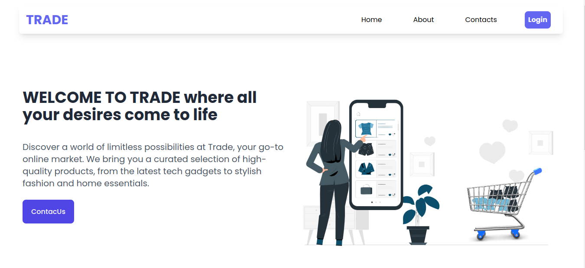

# Trade

Welcome to Trade! This platform provides a seamless shopping experience with a range of features designed to enhance your shopping journey. Below, you'll find an overview of the key functionalities available.


[](./LICENSE)





> ---
>
> **NB: Use the following account to test the application:**
>
> - user_name : Ali
> - password: 22

## Setup

### 1. Clone the repository

```txt
git clone https://github.com/Bisinle/Trade
```

### 2. Navigate to the project's directory

```txt
cd Trade
```

### 3. Install required dependencies

```python
pip install -r requirements.txt

npm install --prefix client
```

### 4. Activate the virtual environment for the Flask app

```python
source myenv/bin/activate
```

### 5. Run the Flask server

You can run the Flask API on [`localhost:5555`](http://localhost:5555) by running:

```sh
python server/main.py
```

### 6. In another terminal, navigate to client folder and run the React

You can run your React app on [`localhost:3000`](http://localhost:3000) by running:

```sh
npm run dev
```

## Usage

Once the application is running, you can:

1. Browse through products.
2. Use the search bar to find specific products.
3. Add products to your wishlist.
4. Add products to your cart.
5. Proceed to checkout.

## Wishlist

1. `Add to Wishlist:` To add a product to your wishlist, click the `♡` button on the product card on the Home page.

2. `Remove from Wishlist:` In the wishlist page, click the red button with a trash icon.

## Cart and Checkout

1. `Add to Cart:` On the product card, click the `Add to Cart` button.

2. `View Cart:` Click on the cart icon on the navbar to view the contents of your cart.

3. `Proceed to Checkout:` In the cart view, click the ` Checkout` button.

## Search

1. `Using the Search Bar:` Type keywords or product names in the search bar located below the banner image in the home page. Relevant results will be displayed in real-time.

## Admin Dashboard

## For administrators:

1. `Access the Dashboard:` Log in with your admin or vendor credentials.

2. `Manage Vendors:` Add, edit, or remove vendors as needed.

## Technologies used.

- React
- Vite
- Python3
- Flask
- SQLAlchemy

## Setup

To download the dependencies for the frontend and backend, run:

```

pipenv install
npm install

```

You can run your React app on `localhost:5173` by running:
`npm run dev`

## Project Setup

1. Clone the repository: `git clone <repository-url>`.
2. Navigate to cloned repository: `cd EcoMart`.
3. Switch to a virtual environment `pipenv shell`.
4. Install dependencies: `pipenv install`
5. Navigate to the `server` directory.
6. Run the `app.py` script.
7. Test your endpoints with the given routes in postman.

# Authors & License

Authors:

- [Abdiwadud Mohamed](https://github.com/Bisinle)
- [Arnold Aswani](https://github.com/arnold-aswan)
- [Aboge Erick](https://github.com/Abogeerick)
- [Jeff Etale](https://github.com/jeffetale)
- [Miriam Rehema](https://github.com/MiriamRehema)

Licensed under the [MIT License](LICENSE) - see the [LICENSE](LICENSE) file for details.

```

```
